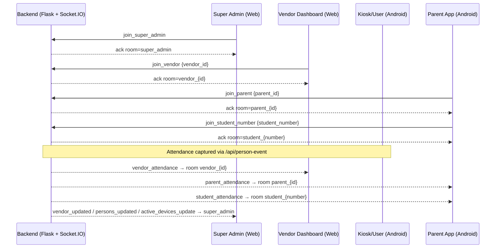

# OpenVisionX Attendance Platform 🚀

Modern face-based attendance for two verticals:
- 🎓 School/College (students + parents)
- 🏭 Daily Wages/Workforce (employees + payroll)

Customer doc:
- [Customer Overview](./CUSTOMER_OVERVIEW.md)

Monorepo includes:
- backend/ → Flask + Socket.IO + Gunicorn (gevent) + Redis + Celery
- FaceRecognition-Android/ → Android (CameraX + custom Face SDK + Retrofit + Socket.IO client)
- web-dashboard/ → React + Vite + Tailwind + Socket.IO client

---

## 🌟 Features
- Real-time attendance with low-bandwidth streaming
- **Client-Side AI Inference**: Hybrid AI model execution directly in the browser using Web Workers + WebGPU (ONNX/MediaPipe), reducing server load by 90% for bulk uploads.
- **Enterprise-Grade High Availability**: Dual-database architecture (PostgreSQL primary, SQLite fallback) with zero-downtime failover and automatic data re-sync upon recovery.
- Business presets at onboarding (School / Wages)
- Parent experience: no-login student number, live updates, date-filtered history
- Vendor dashboards: live feed, employee directory, payroll and detailed reports
- Mobile UX: animated feedback (✅ tick for check-in, 👋 wave for check-out), power-saver
- Push notifications via FCM for parents (optional)

---

## 🧰 Tech Stack
- Backend: Flask, python-socketio, Gunicorn (threading workers), Redis, PostgreSQL (Primary) + SQLite (High-Availability Fallback)
- Android: Kotlin/Java, CameraX, custom Face SDK, Retrofit (+ Gson), Socket.IO client
- Web: React 19, Vite 7, TailwindCSS 4, Web Workers (Client-Side AI), MediaPipe, ONNX Runtime Web
- Hosting: Render (web service + worker + Redis), S3-compatible storage optional

### Automated report email (Gmail SMTP)

Enable `automated_email_reports` for a vendor in the Superadmin portal, then configure its daily, weekly, and/or monthly schedule. Overnight attendance is grouped by the vendor's operational-day cutoff (07:00 by default) and sent at 08:00 in the configured timezone.

Set these environment variables on both the API and Celery worker services:

```env
MAIL_SMTP_HOST=smtp.gmail.com
MAIL_SMTP_PORT=587
MAIL_SMTP_USERNAME=openvisionx@gmail.com
MAIL_SMTP_APP_PASSWORD=<google-app-password>
MAIL_FROM_ADDRESS=openvisionx@gmail.com
MAIL_FROM_NAME=OpenVisionX Reports
```

Run exactly one Celery Beat instance alongside one or more Celery workers. The Beat process checks due schedules every minute; unique delivery records prevent duplicate emails.

For the EC2 installer, run `bash setup_aws.sh` normally. It asks for the Gmail App Password using hidden terminal input and stores it in `backend/.env` with file mode `0600`. For an existing AWS deployment, run `bash setup_aws.sh configure-mail`; this updates only the protected mail configuration and restarts the API, worker, and Beat scheduler. Never place the password directly in `setup_aws.sh`.

### XChat Phase 1 (Mistral)

Enable `xchat_ai` for a vendor in the Superadmin portal. Vendor admins and owners then receive a read-only assistant for attendance summaries, estimated payroll, payroll-period comparisons, employee-hours rankings, and incomplete attendance. Tenant identity comes only from the authenticated server session; it is not exposed as an AI tool argument. Conversation history is private to the vendor and username, retained for 30 days by default, and queries write metadata-only audit events.

On an existing EC2 deployment, securely install a newly generated Mistral key with hidden input:

```bash
bash setup_aws.sh configure-ai
```

For a fresh deployment, `bash setup_aws.sh` asks for it. The script stores it in the protected environment file with mode `0600` and validates the key, billing access, and configured model before interrupting the running application. Runtime calls retry transient `429` and `5xx` responses twice with backoff and log the provider status/code without exposing the key. Do not put API keys in source files or commit them. Optional settings are `MISTRAL_MODEL=mistral-small-latest`, `MISTRAL_TIMEOUT_SECONDS=30`, `MISTRAL_MAX_RETRIES=2`, `XCHAT_HISTORY_DAYS=30`, and `XCHAT_MAX_MESSAGES=200`.

#### Local Whisper voice input

XChat can record a short question in the browser, show a live audio animation, stop after silence, transcribe locally, and submit the resulting text automatically. The AWS installer asks whether to enable it, writes the protected configuration, installs the dependency, starts the services, and verifies that Whisper is ready. No manual environment editing or service command is required.

```env
STT_ENABLED=true
STT_MODEL=base
STT_CPU_THREADS=1
STT_MAX_AUDIO_SECONDS=20
STT_MAX_AUDIO_BYTES=2500000
STT_VAD_MIN_SILENCE_MS=500
STT_LANGUAGE=
```

The model is loaded once during API startup on CPU with INT8 computation. The first enabled startup can take longer while the model is downloaded. Inference is limited to one recording at a time for small servers. Browser microphone access requires HTTPS in production (or localhost during development). Choose `n` at the installer's microphone prompt to write `STT_ENABLED=false`, disable model loading, and hide the microphone.

The installer waits up to 15 minutes for Ubuntu's package-manager lock instead of failing immediately during `unattended-upgrades`. If a later deployment step fails, it also attempts to restore the OpenVision API, Celery worker, and Celery Beat services automatically.

The AWS installer also enables `openvision-boot-check.service`. On every EC2 boot it idempotently starts the installed bare-metal services or Docker Compose stack and verifies the local API health endpoint. It does not repeat package installation, builds, database provisioning, or secret prompts. Run the same check manually with `bash setup_aws.sh boot-check`.

---

## 🗺️ Architecture
```
              +--------------------+           +------------------+
              |    Super Admin     |           |     Vendor       |
              |  Web Dashboard     |           |  Web Dashboard   |
              +----------+---------+           +---------+--------+
                         |                               |
                         | HTTPS (REST + Socket.IO)      |
                         v                               v
                  +------+-------------------------------+------+
                  |               Backend (Flask + Socket.IO)   |
                  |   Gunicorn (gevent) behind LB, Redis adapter|
                  +------+--------------------+------------------+
                         |                    |
                 REST APIs                    | Socket rooms
                         |                    |
      +------------------+----+              +-----------------------------+
      |                       |              |                             |
+-----v-----+         +------v------+   vendor_{vendorId}          student_{number}
| Android   |         | Parent App  |   parent_{parentId}          (parents join)
| Kiosk/User|         | (No-login)  |   (live updates)             (no images)
+-----------+         +-------------+ 
   CameraX              Minimal UI   -> optional FCM push via tokens
   Face SDK             date filter
```

Socket rooms:
- vendor_{id} → live attendance for vendor dashboards
- parent_{id} → parent-linked streams (optional)
- student_{student_number} → lightweight events for parent-mode

## 🧭 Room Usage Diagram (Socket.IO)



References:
- Join endpoints: [APIs (selected)](#%EF%B8%8F-apis-selected) → join_super_admin, join_vendor, join_parent, join_student_number
- Backend join logic: [app.py: join room (admin/vendor)](file:///Users/hashteelab/Documents/trae_projects/face_detection/backend/app.py#L134-L165), [app.py: join room (parent/student)](file:///Users/hashteelab/Documents/trae_projects/face_detection/backend/app.py#L191-L243)
- Emissions to rooms: persons_updated/vendor_updated/attendance_* in [app.py](file:///Users/hashteelab/Documents/trae_projects/face_detection/backend/app.py#L3947-L3949), [app.py](file:///Users/hashteelab/Documents/trae_projects/face_detection/backend/app.py#L4791-L4817), [tasks.py](file:///Users/hashteelab/Documents/trae_projects/face_detection/backend/tasks.py#L48)

---

## 🔌 Key Flows

### Super Admin Onboarding (School)
1. Add New Vendor → select Business: School/College
2. Fill company details, subscription dates/pricing, limits (Max Phones, Max Employees)
3. Architecture preset: frontend bundle + backend service
4. Registration fields preset: Student Number (required), Class/Section (editable)
5. Credentials created (admin + user/kiosk) → vendor_id seeded with company and subscription

Code references:
- Create vendor + presets: [app.py:create_vendor](file:///Users/hashteelab/Documents/trae_projects/face_detection/backend/app.py#L1653-L1766)
- Feature bundles: [app.py:BUNDLE_FEATURES](file:///Users/hashteelab/Documents/trae_projects/face_detection/backend/app.py#L1639-L1646)
- Super Admin UI: [SuperAdminDashboard.jsx](file:///Users/hashteelab/Documents/trae_projects/face_detection/web-dashboard/src/pages/SuperAdminDashboard.jsx)

### Vendor Admin Setup
- Login → configure timetable/shifts (optional), manage employees
- Share user/kiosk credentials to devices

### Enrollment (Students/Employees)
- Capture face → save fields (School: student_number, class/section; Wages: daily_wage, department)
- Stored under faces; extra fields live in custom_data JSON

### Attendance Capture (Kiosk/User)
- Recognize person → backend writes attendance (check-in/out, activity, late flag)
- Emits real-time events:
  - vendor_attendance (rooms vendor_{id})
  - parent_attendance (rooms parent_{id} if linked)
  - student_attendance (rooms student_{number}, image-free)
- Mobile UX shows:
  - ✅ check-in tick + success tone
  - 👋 check-out wave + distinct tone

Code references:
- Attendance route: [person_event](file:///Users/hashteelab/Documents/trae_projects/face_detection/backend/app.py#L4097-L4850)
- Kiosk feedback: [IdentifyFragment.java](file:///Users/hashteelab/Documents/trae_projects/face_detection/FaceRecognition-Android/app/src/main/java/com/faceplugin/facerecognition/IdentifyFragment.java#L358-L392)

### Parent Mode (No-login)
- Enter student_number → join room student_{number}
- Fetch history:
  - GET /api/public/attendance-by-student?student_number=...&date=YYYY-MM-DD
  - Or ranged: &from=YYYY-MM-DD&to=YYYY-MM-DD
- Optional push: app registers FCM token; backend sends FCM on events if FCM_SERVER_KEY is present

Code references:
- Public history: [public_attendance_by_student](file:///Users/hashteelab/Documents/trae_projects/face_detection/backend/app.py#L3616-L3676)
- Token register: [public_register_token](file:///Users/hashteelab/Documents/trae_projects/face_detection/backend/app.py#L4851-L4890)
- Parent Android: [ParentActivity.kt](file:///Users/hashteelab/Documents/trae_projects/face_detection/FaceRecognition-Android/app/src/main/java/com/faceplugin/facerecognition/ParentActivity.kt)

---

## 📦 Data Model (simplified)
- vendors (company_name, vertical, bundle ids, config)
- subscriptions (vendor_id, plan, dates, limits, costs, features)
- companies (vendor_id, shifts, timetables)
- system_users (username, password, role, vendor_id)
- faces (id, name, vendor_id, shift, custom_data JSON with school/wages fields)
- attendance (name/person_id, timestamp, status, activity, is_late, vendor_id, captured_image?)
- student_parents (vendor_id, person_id, parent_id) optional linking
- parent_tokens (vendor_id, student_number, token) for FCM

---

## �️ Database Schema

ER overview:
```
vendors (id) 1---* subscriptions (vendor_id)
      | 1---1 companies (vendor_id)
      | 1---* system_users (vendor_id)
      | 1---* faces (vendor_id)
      | 1---* attendance (vendor_id)
      | 1---* student_parents (vendor_id)
      | 1---* parent_tokens (vendor_id)
      | 1---* vendor_devices (vendor_id)
```

Tables and key columns:
- vendors
  - id INTEGER PK
  - company_name TEXT
  - contact_person TEXT, phone TEXT, email TEXT
  - vertical TEXT (school | wages | enterprise)
  - frontend_bundle_id TEXT, backend_service_id TEXT
  - web_login_enabled INTEGER (0/1)
  - registration_config TEXT (JSON schema for mobile registration)
  - config TEXT (misc vendor config)
- subscriptions
  - id INTEGER PK
  - vendor_id INTEGER FK → vendors.id
  - plan_type TEXT ('custom' etc.)
  - start_date TEXT (YYYY-MM-DD), end_date TEXT
  - max_users INTEGER, max_employees INTEGER, max_mobile_devices INTEGER
  - cost_per_user INTEGER, cost_per_employee INTEGER, setup_fee INTEGER
  - features TEXT (JSON array)
  - setup_fee_paid INTEGER (0/1, optional)
- companies
  - id INTEGER PK
  - vendor_id INTEGER FK → vendors.id
  - name TEXT
  - shifts TEXT (JSON array), draft_timetable TEXT (JSON), live_timetable TEXT (JSON)
- system_users
  - id INTEGER PK
  - username TEXT UNIQUE
  - password TEXT
  - role TEXT ('super_admin' | 'vendor_admin' | 'user')
  - vendor_id INTEGER FK → vendors.id (NULL for super_admin)
- faces
  - id INTEGER PK
  - name TEXT
  - vendor_id INTEGER FK → vendors.id
  - shift TEXT (name)
  - department TEXT, designation TEXT (optional)
  - face_image BLOB/TEXT (base64), templates BLOB
  - custom_data TEXT (JSON; school: {student_number, class_section}, wages: {daily_wage, department})
- attendance
  - id INTEGER PK
  - person_id INTEGER FK → faces.id (nullable when only name is available)
  - vendor_id INTEGER FK → vendors.id
  - name TEXT
  - timestamp TEXT ('YYYY-MM-DD HH:MM:SS[.mmm]')
  - status TEXT ('CHECK_IN' | 'CHECK_OUT')
  - activity TEXT ('Work' | 'Lunch' | 'Tea' etc.)
  - is_late INTEGER (0/1)
  - captured_image TEXT (base64, optional)
- student_parents
  - id INTEGER PK
  - vendor_id INTEGER FK → vendors.id
  - person_id INTEGER FK → faces.id
  - parent_id INTEGER (application-level parent identifier)
- parent_tokens
  - id INTEGER PK
  - vendor_id INTEGER FK → vendors.id
  - student_number TEXT
  - token TEXT UNIQUE (FCM token)
  - created_at DATETIME DEFAULT CURRENT_TIMESTAMP
- vendor_devices
  - id INTEGER PK
  - vendor_id INTEGER FK → vendors.id
  - device_id TEXT, device_name TEXT
  - created_at DATETIME DEFAULT CURRENT_TIMESTAMP
- system_settings
  - key TEXT PK
  - value TEXT

Indexes (recommended):
- attendance: (vendor_id, timestamp), (person_id, timestamp), (name, timestamp)
- faces: (vendor_id, name), (vendor_id, id)
- parent_tokens: (vendor_id, student_number), token UNIQUE
- system_users: username UNIQUE, (vendor_id, role)

Notes:
- Dates are stored as TEXT for portability; APIs format and parse ISO consistently.
- Features/registration_config/shifts/timetables use JSON text for flexibility.
- Parent experience never carries images; student_attendance events omit captured_image.

---

## �🔗 APIs (selected)
- Auth & admin:
  - POST /api/login, POST /api/register-user (vendor)
  - GET/POST /api/admin/vendors (+ subscription, features, registration-config)
- Attendance:
  - POST /api/person-event (kiosk)
  - GET /api/attendance (vendor)
  - GET /api/public/attendance-by-student (parents)
  - POST /api/public/register-token (parents push)
- Sockets:
  - join_super_admin, join_vendor, join_parent, join_student_number
  - Events: attendance_updated, parent_attendance, student_attendance

---

## 📱 Android Highlights
- CameraX preview with Face SDK recognition
- Power-saving overlay after inactivity
- Offline queue for attendance when API fails
- Real-time socket streaming (throttled ~1 FPS, 320px JPEG)
- Tick/wave overlays and tones for status feedback

### Run Mobile on Local Network
- Ensure phone/device and laptop are on the same Wi‑Fi.
- Start backend locally:
  - `cd backend && python app.py` → binds `0.0.0.0:5001` for LAN access ([app.py run](file:///Users/hashteelab/Documents/trae_projects/face_detection/backend/app.py#L5750-L5755)).
- Find your laptop’s LAN IP (e.g. 192.168.x.y).
- In the mobile app, set server URL to `http://<LAN_IP>:5001`:
  - On login screen: tap server URL to edit; persists via SharedPreferences ([LoginActivity.kt](file:///Users/hashteelab/Documents/trae_projects/face_detection/FaceRecognition-Android/app/src/main/java/com/faceplugin/facerecognition/LoginActivity.kt#L167-L185)).
  - Retrofit base URL updates at runtime ([RetrofitClient.java](file:///Users/hashteelab/Documents/trae_projects/face_detection/FaceRecognition-Android/app/src/main/java/com/faceplugin/facerecognition/api/RetrofitClient.java#L18-L25)).
  - Socket.IO uses the same saved server_url in kiosk/identify flows ([IdentifyFragment.java](file:///Users/hashteelab/Documents/trae_projects/face_detection/FaceRecognition-Android/app/src/main/java/com/faceplugin/facerecognition/IdentifyFragment.java#L127-L135), [CameraActivity.java](file:///Users/hashteelab/Documents/trae_projects/face_detection/FaceRecognition-Android/app/src/main/java/com/faceplugin/facerecognition/CameraActivity.java#L109-L117)) and in parent mode ([ParentActivity.kt](file:///Users/hashteelab/Documents/trae_projects/face_detection/FaceRecognition-Android/app/src/main/java/com/faceplugin/facerecognition/ParentActivity.kt#L91-L99)).
- Emulator tip: use `http://10.0.2.2:5001` instead of LAN IP.
- macOS firewall: allow incoming connections for Python on port 5001 if prompted.
- No HTTPS required for LAN: cleartext HTTP is allowed in the app manifest ([AndroidManifest.xml](file:///Users/hashteelab/Documents/trae_projects/face_detection/FaceRecognition-Android/app/src/main/AndroidManifest.xml#L12-L22)).
- Do not set the mobile app to the frontend URL (`:5173`); use the backend URL (`:5001`).

Build:
```
cd FaceRecognition-Android
./gradlew assembleDebug
```

---

## 💻 Web Dashboard
- React + Vite; Tailwind-based UI
- Super Admin:
  - Vendor onboarding wizard (vertical presets, plan, features, registration fields)
  - Lists, limits, invoices, web access toggles
- Vendor:
  - Live attendance feed, employees directory, reports (payroll/detailed), date filters

Dev:
```
cd web-dashboard
npm install
npm run dev
```

---

## ☁️ Deployment (Render)
- render.yaml provisions:
  - face-detection-backend (Python web): Gunicorn gevent workers
  - face-detection-celery (Python worker)
  - face-detection-redis (Redis)
  - face-detection-frontend (Static React)
- Health check: /api/ping
- Socket.IO runs under gevent; Redis used for adapter and Celery broker

Environment (backend):
- SECRET_KEY → JWT/session signing
- BACKEND_URL, FRONTEND_URL → CORS/config
- REDIS_URL, CELERY_BROKER_URL, CELERY_RESULT_BACKEND → Redis endpoints
- FCM_SERVER_KEY → enable parent push notifications
- AWS_* / S3_BUCKET (optional) → object storage for images/logs

Start command:
```
gunicorn -k gevent --worker-connections 1000 -w 2 --timeout 120 app:app --bind 0.0.0.0:$PORT
```

---

## 📈 Scalability (ballpark)
- Single worker: 300–500 concurrent mobile clients with 1 FPS streaming
- Multi-worker + Redis: 5,000–10,000 mobile; 50,000–100,000+ parents
- Admin sessions: thousands; light traffic

---

## 🔒 Security
- Roles: super_admin, vendor_admin, user/kiosk
- Vendor scoping on API; socket rooms segregated per vendor/student/parent
- Rate limiting on public endpoints; no parent images exposed
- JWT for auth; optional web access toggles

---

## 🧪 Local Setup (quick)
Backend:
```bash
cd backend
python -m venv .venv && . .venv/bin/activate
pip install -r requirements.txt

# Configure Environment
# DATABASE_URL: Primary PostgreSQL connection string
# DB_PATH: Fallback SQLite database path
cp .env.example .env
# Edit .env to set your DATABASE_URL

python app.py
```
Web:
```bash
cd web-dashboard
npm install && npm run dev
```
Android: open in Android Studio → build & run

---

## 💬 FAQs
- Parent push isn’t firing?
  - Ensure FCM_SERVER_KEY is set in backend env; parent app must register a token via /api/public/register-token.
- Timezone mismatches?
  - Client should send ISO timestamp in person_event; backend falls back to server time if missing.
- Multiple shifts or night shifts?
  - Backend picks the best activity match with strict shift filtering and spillover handling.

---

## 🤝 Contributing
- Fork, branch per feature, submit PR
- Keep UI responsive, avoid logging secrets, and follow existing code patterns

---

## 📎 Useful Code References
- Backend attendance flow: [person_event](file:///Users/hashteelab/Documents/trae_projects/face_detection/backend/app.py#L4097-L4850)
- Public parent API: [public_attendance_by_student](file:///Users/hashteelab/Documents/trae_projects/face_detection/backend/app.py#L3616-L3676)
- Token register & FCM push: [public_register_token](file:///Users/hashteelab/Documents/trae_projects/face_detection/backend/app.py#L4851-L4890)
- Android parent notifications: [ParentActivity.kt](file:///Users/hashteelab/Documents/trae_projects/face_detection/FaceRecognition-Android/app/src/main/java/com/faceplugin/facerecognition/ParentActivity.kt)
- Kiosk feedback overlays: [IdentifyFragment.java](file:///Users/hashteelab/Documents/trae_projects/face_detection/FaceRecognition-Android/app/src/main/java/com/faceplugin/facerecognition/IdentifyFragment.java)
- Super Admin dashboard: [SuperAdminDashboard.jsx](file:///Users/hashteelab/Documents/trae_projects/face_detection/web-dashboard/src/pages/SuperAdminDashboard.jsx)


Useful PM2 Commands

- Status: pm2 ls
- Logs: pm2 logs face-web-dev
- Restart: pm2 restart face-web-dev
- Stop: pm2 stop face-web-dev
- Autostart on boot: pm2 save && pm2 startup

pm2 start web-dashboard/ecosystem.config.cjs --only face-web-dev
